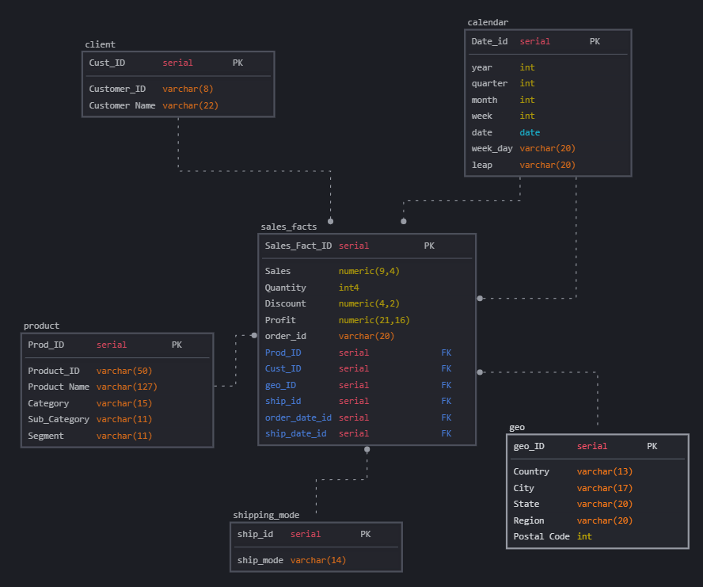

# DE-101: Аналитическая работа с базами данных

## 📑 Описание
Проект содержит SQL-запросы для создания и заполнения таблиц на основе данных из Superstore, а также основные аналитические запросы, реализованные в формате SQL.

### 📂 Структура проекта

#### Часть 1: Импорт данных из Excel в базу данных
- **orders.sql** - создание таблицы заказов и добавление данных.
- **people.sql** - создание таблицы менеджеров и добавление данных.
- **returns.sql** - создание таблицы возвратов и добавление данных.
- **запросы по superstore.sql** - основные аналитические запросы, аналогичные выполненным в Excel.

#### Часть 2: Построение DWH на основе данных Superstore
- **conceptual.png** - концептуальная модель данных.  

- **physical.png** - физическая модель данных.  

- **from_stg_to_dw.sql** - скрипт загрузки данных из stg в dw.

#### Часть 3: Развёртывание PostgreSQL на сервере и импорт данных

- Был развёрнут сервер PostgreSQL на удалённой машине (VPS с Ubuntu 22.04).
- Настроен внешний доступ (`listen_addresses = '*'`, порт 5432 открыт).
- Создан пользователь `superuser` и база данных `superstore`.
- Через DBeaver выполнено подключение к серверу.
- Выполнен импорт данных из Excel в схему `stg`: таблицы `orders`, `people`, `returns`.

📸 Подключение к серверу по SSH  


📸 Настройки подключения в DBeaver  


📸 Структура схемы stg  


📸 Структура схемы dw  


### 🚀 Установка
1. Клонировать репозиторий:
   ```bash
   git clone https://github.com/Marshmello7z/de-101.git
