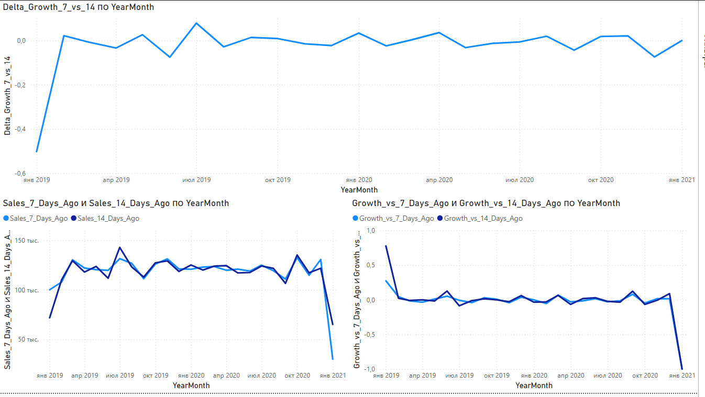
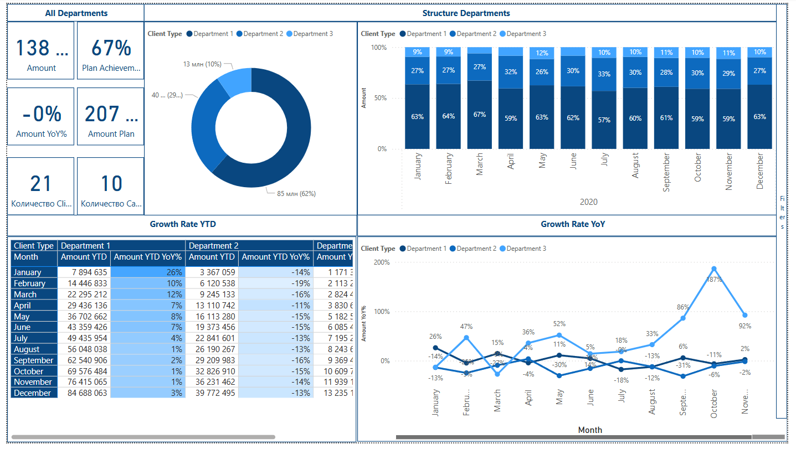
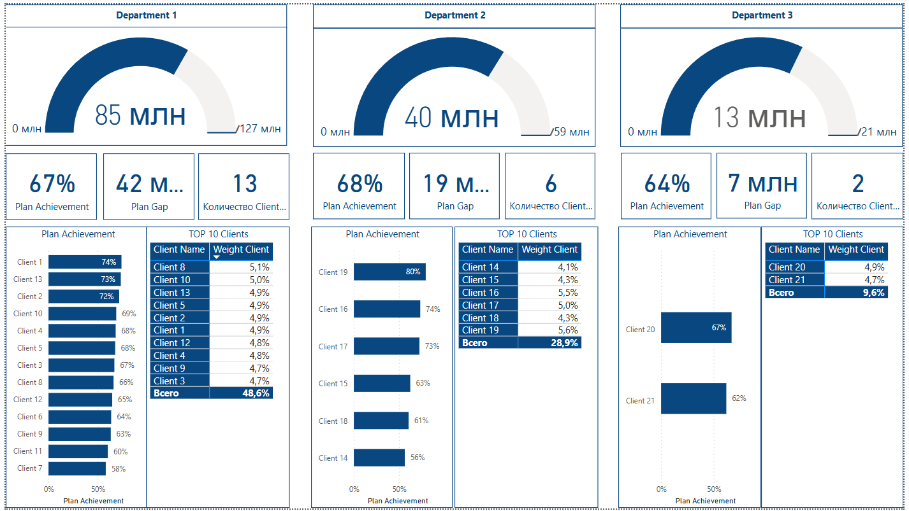
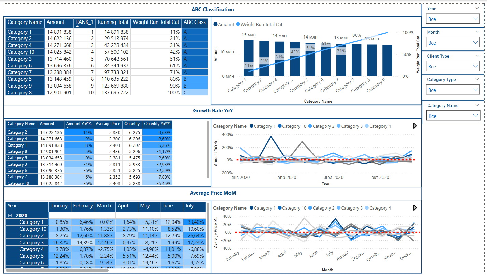
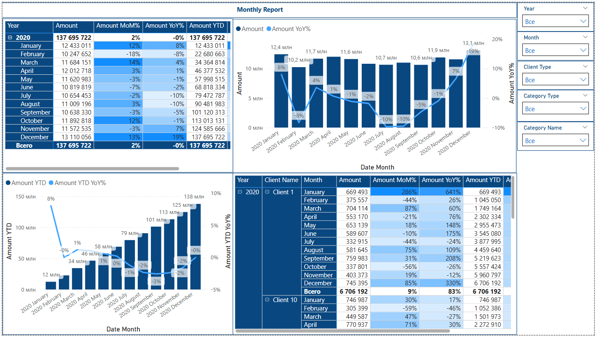
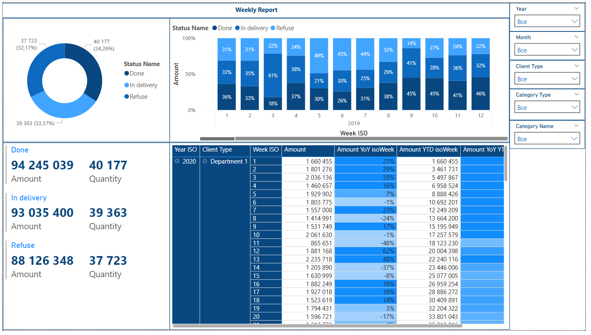

# 📊 Module3 — Аналитика и визуализация Tableau

В этом модуле собраны результаты анализа и визуализации данных из датасета Superstore с помощью Tableau.

---

## Содержание

- Визуализация динамики продаж и прибыли по категориям и субкатегориям
- Географический анализ продаж по штатам и регионам США
- Эффективность менеджеров по продажам
- Анализ возвратов заказов
- Динамика и структура продаж по сегментам клиентов
- Анализ и визуализация в Power BI

---

## Скриншоты

### 1. Основная информация и динамика продаж  
[Посмотреть онлайн](https://public.tableau.com/views/superstoreDB_examlpe_Ivan_S/Dashboard1)  

---

### 2. Анализ категорий и субкатегорий  
[Посмотреть онлайн](https://public.tableau.com/views/superstoreDB_examlpe_Ivan_S/Dashboard3)  

---

### 3. Географический анализ продаж  
[Посмотреть онлайн](https://public.tableau.com/views/superstoreDB_examlpe_Ivan_S/regionDB)  

---

### 4. Анализ сегментов клиентов  
[Посмотреть онлайн](https://public.tableau.com/views/superstoreDB_examlpe_Ivan_S/segmentDB)  

---

## Power BI: Анализ данных Superstore

В рамках модуля также были изучены возможности визуализации в Power BI.  
Были построены дашборды, отражающие различные аспекты работы с данными: динамику, структуру, достижение целей и клиентские показатели.

---

### 📈 Визуализация: сравнение прироста продаж за 7 и 14 дней  
Анализ относительных изменений по сравнению с предыдущими неделями для выявления нестабильностей в продажах.  

---

### 📊 Дополнительные дашборды  
Также был произведён анализ и изучение готовых дашбордов для оценки комплексной визуализации:  
  
  
  
  

---

## Используемые инструменты

- Tableau Desktop
- Power BI Desktop
- Датасет Superstore (`superstore_clean.csv`)
- Датасет  (`DataLearnDatasetHW.xlsx')

---

## Запуск и просмотр

- Открыть Tableau или Power BI
- Загрузить файл `superstore_clean.csv`
- Открыть соответствующие визуализации
- Использовать фильтры и временные шкалы для анализа

---

*Автор: Ivan Sidorov*
