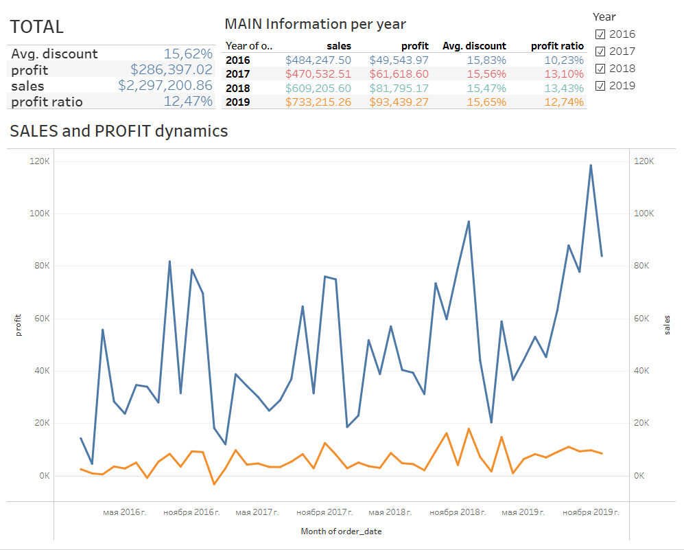
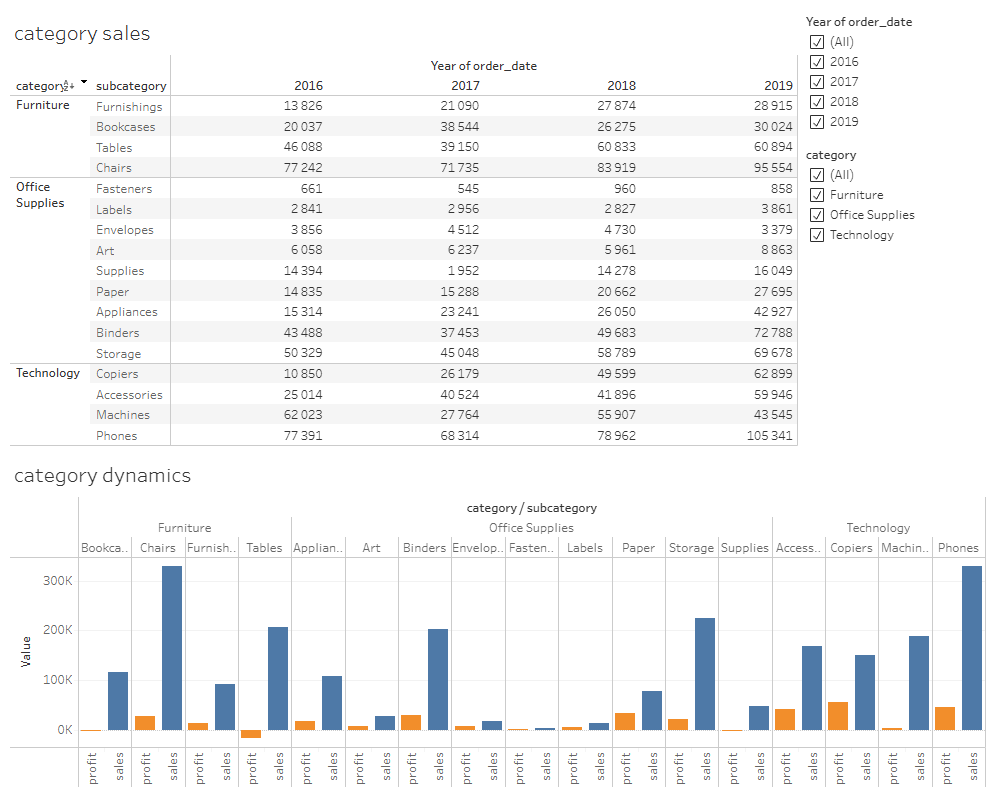
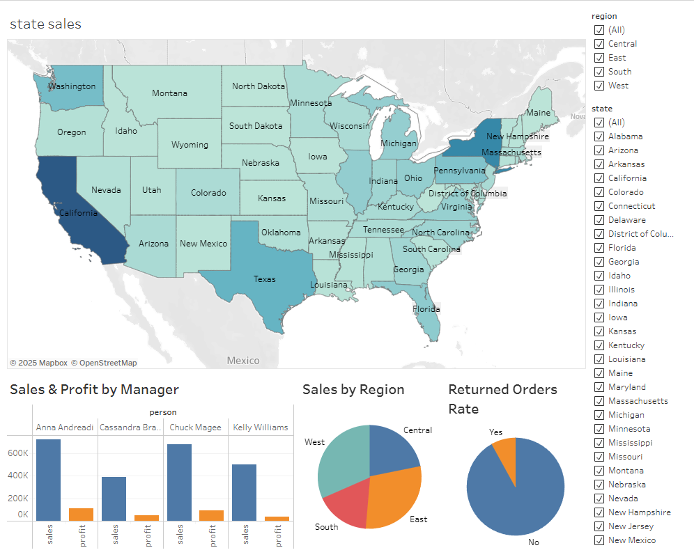
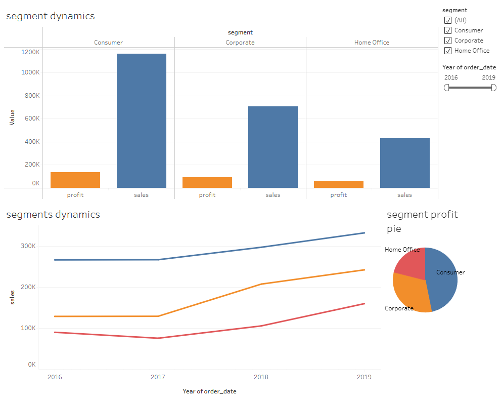

# 📊 Module3 — Аналитика и визуализация Tableau

В этом модуле собраны результаты анализа и визуализации данных из датасета Superstore с помощью Tableau.

---

## Содержание

- Визуализация динамики продаж и прибыли по категориям и субкатегориям
- Географический анализ продаж по штатам и регионам США
- Эффективность менеджеров по продажам
- Анализ возвратов заказов
- Динамика и структура продаж по сегментам клиентов

---

## Скриншоты

### 1. Основная информация и динамика продаж  
[Посмотреть онлайн](https://public.tableau.com/views/superstoreDB_examlpe_Ivan_S/Dashboard1)  

---
### 2. Анализ категорий и субкатегорий  
[Посмотреть онлайн](https://public.tableau.com/views/superstoreDB_examlpe_Ivan_S/Dashboard3)  

---

### 3. Географический анализ продаж  
[Посмотреть онлайн](https://public.tableau.com/views/superstoreDB_examlpe_Ivan_S/regionDB)  

---

### 4. Анализ сегментов клиентов  
[Посмотреть онлайн](https://public.tableau.com/views/superstoreDB_examlpe_Ivan_S/segmentDB)  

---

## Используемые инструменты

- Tableau Desktop
- Датасет Superstore (superstore_clean.csv)

---

## Запуск и просмотр

- Открыть Tableau Desktop
- Загрузить файл с датасетом `superstore_clean.csv`
- Открыть каждый из листов и просмотреть визуализации
- Для детального изучения использовать фильтры справа
- **Посмотреть весь онлайн-дашборд:** [Superstore Tableau Dashboard](https://public.tableau.com/authoring/superstoreDB_examlpe_Ivan_S)

---

*Автор: Ivan Sidorov*
