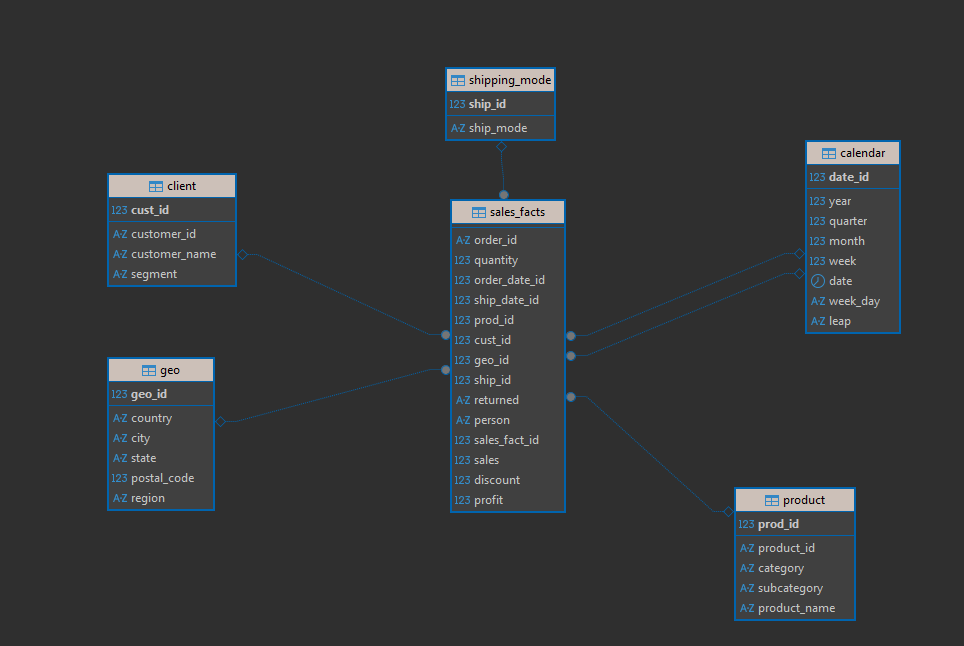
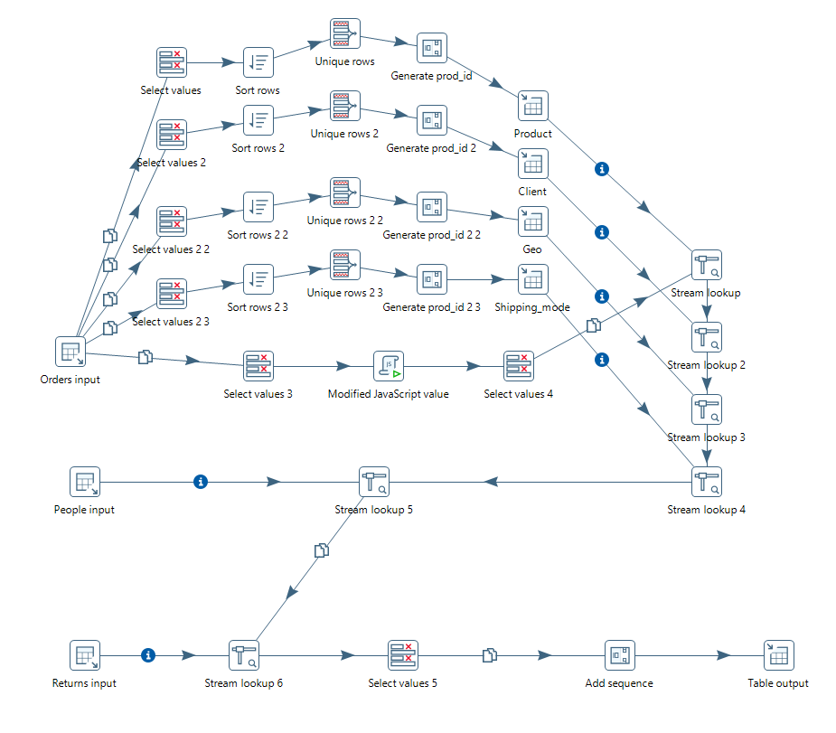

# Module4: Построение DWH (хранилища данных) и ETL-процессов в Pentaho DI

## Описание
В модуле реализован полный цикл создания витрины данных на основе датасета [Sample - Superstore.xls](https://github.com/Data-Learn/data-engineering/raw/master/DE-101%20Modules/Module02/data/Sample%20-%20Superstore.xls):

- Создание нормализованных справочников (product, client, geo, shipping_mode, calendar)
- Построение fact-таблицы sales_facts по star schema (звездчатая схема)
- Автоматизация ETL на Pentaho Data Integration (Spoon)
- Проверка связей и финальный join

Практика выполнена в рамках курса DataLearn, DE-101 (модуль 4.4.2).

---

## Состав модуля

- **stg_to_dw.ktr** — основная трансформация ETL в Pentaho DI  
- **dw_diagram.png** — ER-диаграмма итоговой структуры данных  
- **stg_to_dw_pic.png** — схема самого ETL-процесса  
- **sql/create_tables.sql** — SQL-скрипт создания таблиц  
- **sql/add_foreign_keys.sql** — SQL для внешних ключей  
- **README.md** — этот файл

---

## Как проверить и воспроизвести

1. **Создайте структуру таблиц**
    - Выполните скрипт `sql/create_tables.sql`
    - Добавьте внешние ключи через `sql/add_foreign_keys.sql`

2. **Откройте Pentaho DI (Spoon)**
    - Импортируйте трансформацию `stg_to_dw.ktr`
    - Проверьте пути к файлу данных (Sample - Superstore.xls)
    - Запустите трансформацию

3. **Убедитесь, что данные успешно загружены**
    - Проверьте таблицы через SQL или DBeaver
    - Проверьте корректность join'ов (пример запроса ниже)

---

## Визуализация

### Итоговая ER-диаграмма  


### ETL-процесс (Pentaho DI)  


---

## Пример финального запроса

```sql
SELECT f.*, p.product_name, c.customer_name, g.city, cal.date, sm.ship_mode
FROM sales_facts f
JOIN product p ON f.prod_id = p.prod_id
JOIN client c ON f.cust_id = c.cust_id
JOIN geo g ON f.geo_id = g.geo_id
JOIN calendar cal ON f.order_date_id = cal.date_id
JOIN shipping_mode sm ON f.ship_id = sm.ship_id
LIMIT 10;
